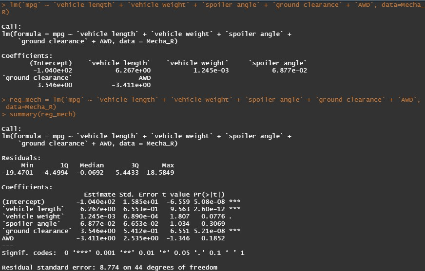
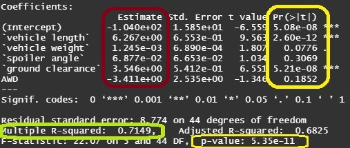

# MechaCar Prototypes Using RStudio
Using R language to gain an understanding of statistics and hypothesis testing to analyze datasets from the prototype automotive industry with statistics. 

## MechaCar Prototypes:

MechaCar prototype is suffering from manufacturing and production troubles. The team has insisted on the help of an aspiring R language user to mitigate the halt
on making the dream car. The challenge was to perform series of statistical tests and create a technical report that provides interpretation of findings with the
use of R, a programming language and free software environment for statistical computing and graphics, in a software environment called RStudio.

### Background
The team had provided 2 complete datasets. The first dataset is comprised of different design specification such as vehicle length, vehicle weight, ground
clearance, MPG (miles per gallon).

The second dataset consists of MechaCar coil suspension test results from different manufacturing lots. The coils test
the weight capacity of different prototypes.

This is a technical report which will aim to construct and justify design choices with qualitative and quantitative reasoning.

Here is a snippet of RStudio.

### Test 1: Multiple Linear Regression

I identified variables of interest by using Multiple Linear Regression analysis on the MechaCar MPG
prototypes. At first, some variables displayed significant relationships with other variables, such as MPG
and vehicle length. Using regression analysis at each dependent variable, low p-values were found to have
less random variance to the linear model. Thus, these variables have more impact on the MPG. These were
vehicle length and ground clearance.

The Y-intercept also had an exceedingly small p-value, which suggests that not many factors contributed
to the regression of MPG. Since p-value was higher for vehicle weight, spoiler angle, and AWD
(all-wheel drive), those variables offered more random variability, thus they have a less chance of affecting
MPG. 

The calculation of the regression slope and y intercept determines the distance between each data
point of a graphed dataset. The slope was found not to be zero since, assuming the significance level of
0.05% with normal importance of findings, the multiple regression p-value is 5.35e-11, which portrays the
slope is not zero, having enough ground to reject the null hypothesis.

The result of this test was to use a linear model to predict MPG of MechaCar prototypes effectively.
In conclusion, the linear model can predict the MPG since the r-squared value is .71, meaning 71% of all 
mpg predictions will be correct when using this linear model and our p-value is much smaller than 0.05%,
which would suggest that the overall slope of our linear model is not zero.

    Yellow: Individual and Combined p-values
    Red: Slopes
    Green: R-squared values

### Test 2: Suspension Coils Summary
In this test, the team needed a summary statistic for the suspension coil’s PSI
(pounds-per square inch) and verify the variance of PSI. The current manufacturing data met this design
specification since the variance of PSI is 76.23, which is under 100 psi. 

### Test 3: T-Test 

This test relied on the Student T-Test which should determine if the suspension coil’s
PSI results are statistically different from the mean population results of 1,500 PSI. Taking 30 sample 
datapoints from the 150 datapoints from the population dataset, the density graphs of both population 
and sample look similar. Since we are comparing mean population dataset and sample dataset, the use of 
one-sample t-test would make sense.

Since 0.05% is the significance level, our p-value of .63 is above our significance level, which
suggests that the two means are statistically similar. The test also has a 95% confidence interval of
1494.9-1502.4, which would mean the population mean of 1500 falls under the 95% confidence interval.

### Further Analysis and Testing: Design a Statistical Study
The team wanted to further expand their MechaCar prototype testing to evaluate their competition’s
comparable vehicles on the market. One design study that would require further research could be comparing
fuel efficiencies of MechaCar prototypes with their competition. A possible null hypothesis could be whether
top performing MPG of MechaCar Prototypes have the same fuel efficiency as the competitors cars’ MPG.
The alternate hypothesis would be whether MPG of MechaCar samples have a positive delta change,
thus MechaCar would be beating out other competitors’ fuel efficiency.

The collected data needed for statistical analysis could be collected from top 5 samples
of MechaCar prototypes that have varying design specifications from vehicle lengths and ground clearance 
because it was presented clearly that those specifications affect MPG the most. Then we could match
those specifications with the competitors’ cars and analyze both MPG. Thus, we would be able to crown a winner
in fuel efficiency. Another method could be to call a subset for each manufacturing lot and perform a t-test to see which lot is not meeting the standard.
